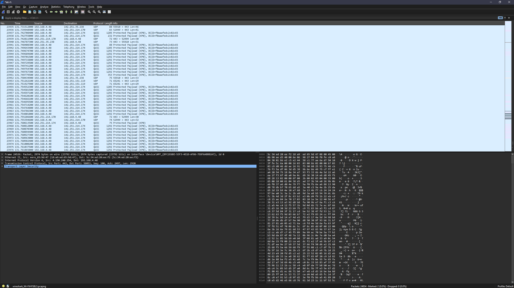
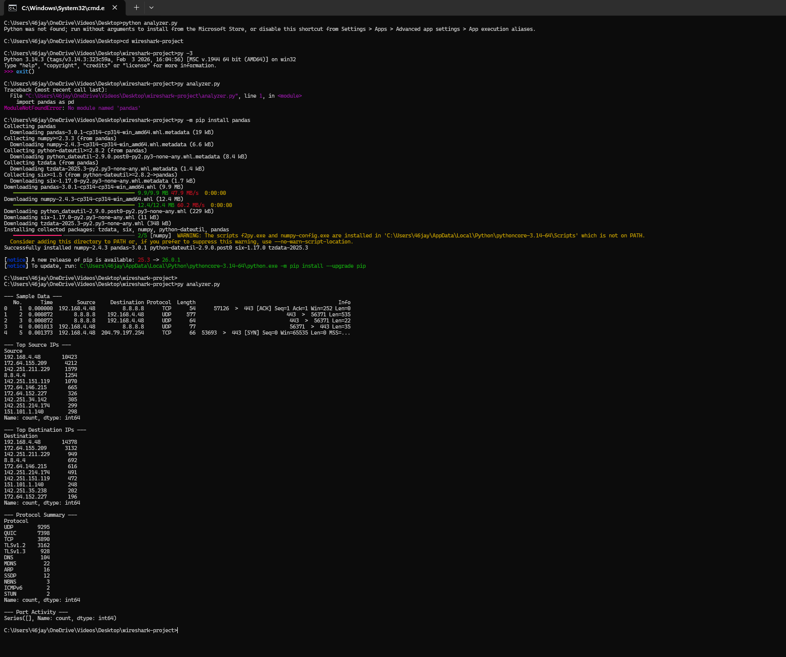
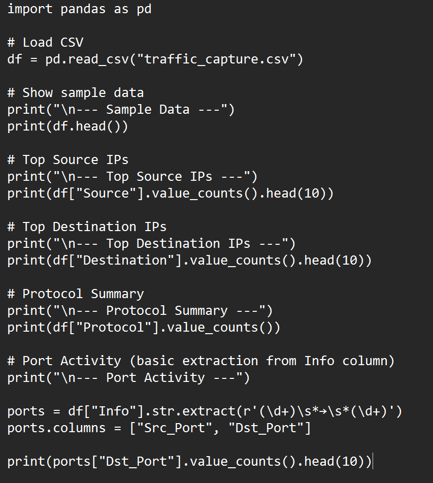
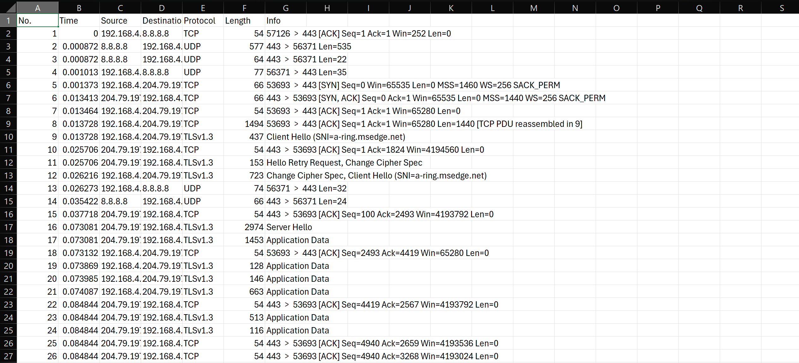

# Wireshark Traffic Analysis Automation

## Overview

In this project, I captured network traffic using Wireshark and built a Python script to automate packet analysis. The script processes exported traffic data to identify top IP addresses, protocols, and port activity. This project demonstrates how network data can be analyzed to detect patterns and support threat investigation.

## Tools Used

- Wireshark  
- Python  
- Pandas  

## Features

- Captures live network traffic  
- Processes packet data from CSV exports  
- Identifies top source IP addresses  
- Identifies top destination IP addresses  
- Summarizes protocol usage  
- Extracts and analyzes port activity  

## Detection Use Case

### Scenario

A security analyst reviews network traffic to identify unusual patterns that may indicate suspicious activity such as scanning, data exfiltration, or unauthorized connections.

### Detection Logic

Analyze packet data to identify:

- High-frequency source or destination IPs  
- Unusual protocol usage  
- Repeated connections to specific ports  
- Traffic patterns that deviate from normal behavior  

### Investigation

I captured network traffic using Wireshark and exported the data to a CSV file. I then used a Python script with Pandas to analyze the dataset and extract:

- Top communicating IP addresses  
- Most common protocols  
- Frequently used ports  

This automated approach reduces manual analysis time and helps identify patterns that may require further investigation.

## Key Findings

- Network traffic can be efficiently analyzed using automation  
- High-volume IP activity can indicate scanning or repeated connections  
- Protocol and port analysis helps identify common communication patterns  
- Python scripting improves speed and consistency of analysis  

## Investigation Insight

This project demonstrates how automation can support network traffic analysis in a security environment. By combining packet capture with scripted analysis, analysts can quickly identify patterns and focus on potential threats.

## What I Learned

This project showed how to combine Wireshark and Python to analyze network traffic more efficiently. Automating analysis with Pandas allows for faster identification of key patterns in packet data. This approach reflects how security teams process large volumes of network data during investigations.

## Screenshots

### Wireshark Capture  

### Python Output  

### Code  

### Data  

