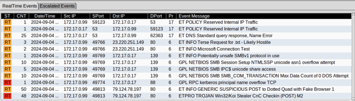
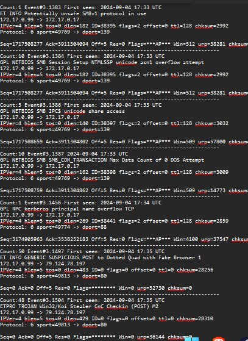
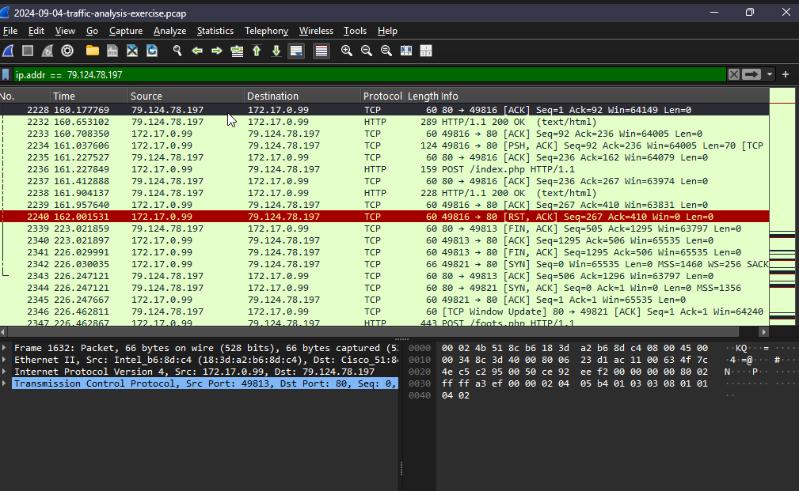
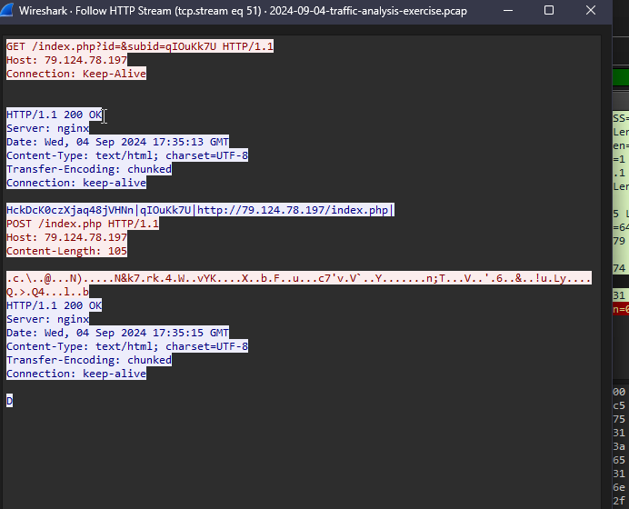
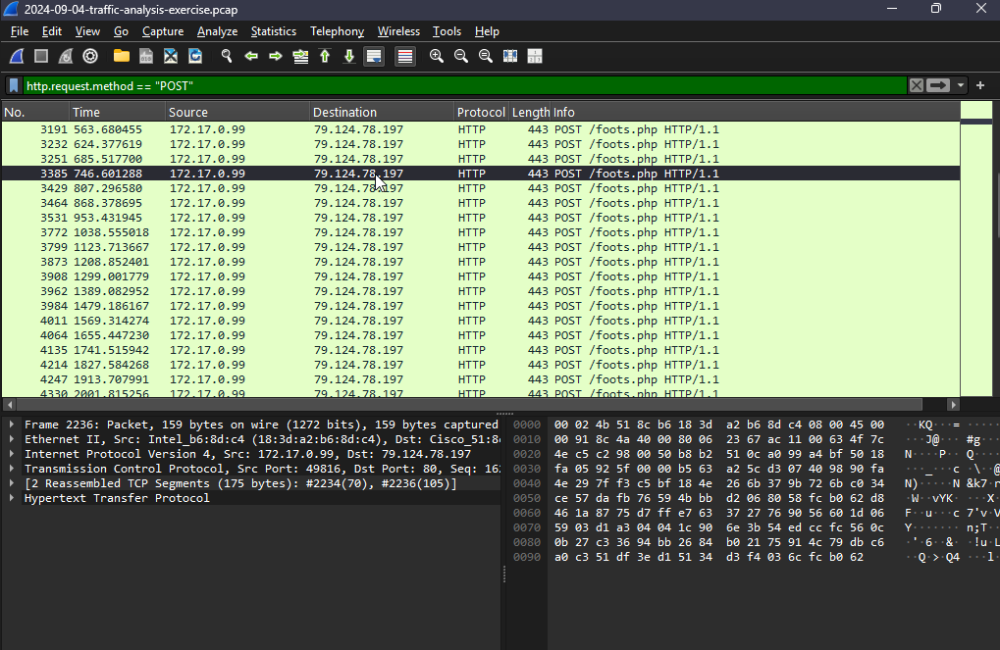
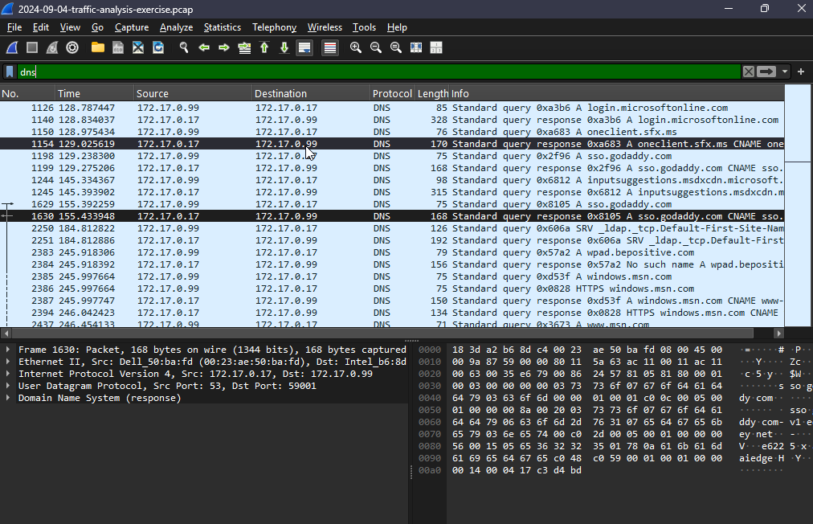

# Traffic Analysis Exercise — Koi Stealer (2024-09-04)

**Source:** Malware-Traffic-Analysis.net  
**Exercise:** Big Fish in a Little Pond  
**Date:** September 4, 2024  
**Tools:** Wireshark, Suricata alerts  

## Environment

- LAN segment: 172.17.0.0/24
- Domain: bepositive.com
- AD controller: 172.17.0.17 — WIN-CTL9XBQ9Y19
- Victim IP: 172.17.0.99

## Findings

**Malware:** Koi Stealer  
**C2 IP:** 79.124.78.197:80  
**C2 endpoints:** /index.php (beacon), /foots.php (exfiltration)  
**C2 server:** nginx  

Victim beaconed to C2 at 17:35:13 UTC via GET /index.php with a unique session ID. POST requests to /foots.php followed at ~60-second intervals, sending obfuscated stolen data. Suricata confirmed Koi Stealer C2 checkin via ETPRO signature. SMB scanning activity observed on the internal LAN segment consistent with lateral movement attempts.

## MITRE ATT&CK

| Technique | ID |
|---|---|
| Application Layer Protocol: Web Protocols | T1071.001 |
| Exfiltration Over C2 Channel | T1041 |
| SMB/Windows Admin Shares | T1021.002 |

## IOCs

| Type | Value |
|---|---|
| C2 IP | 79.124.78.197 |
| C2 URL | http://79.124.78.197/index.php |
| C2 URL | http://79.124.78.197/foots.php |
| Victim IP | 172.17.0.99 |
| Session ID | qIOuKk7U |

## Screenshots

https://malware-traffic-analysis.net/2024/09/04/index.html
